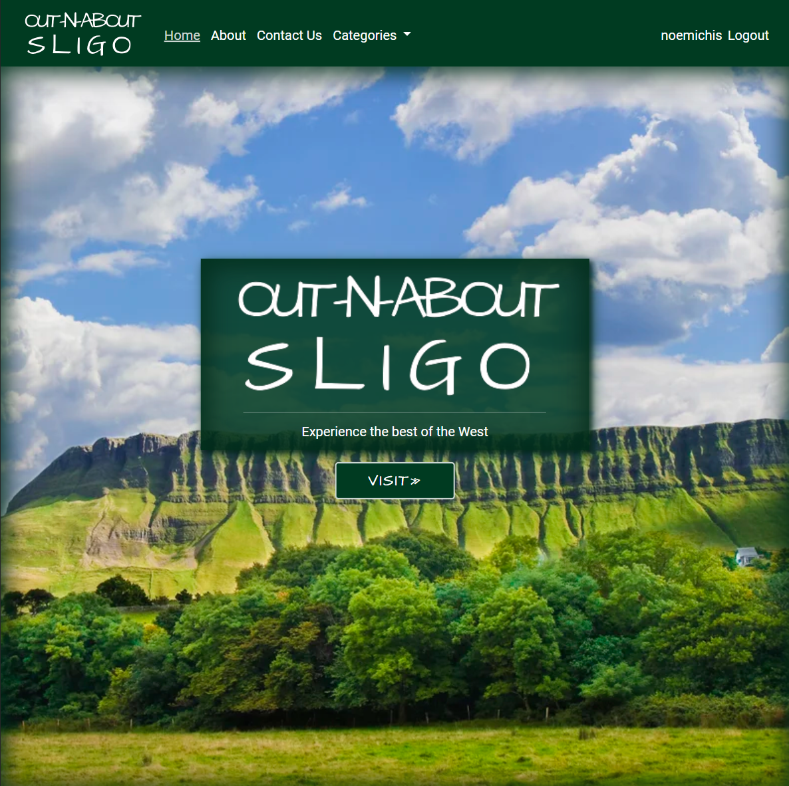
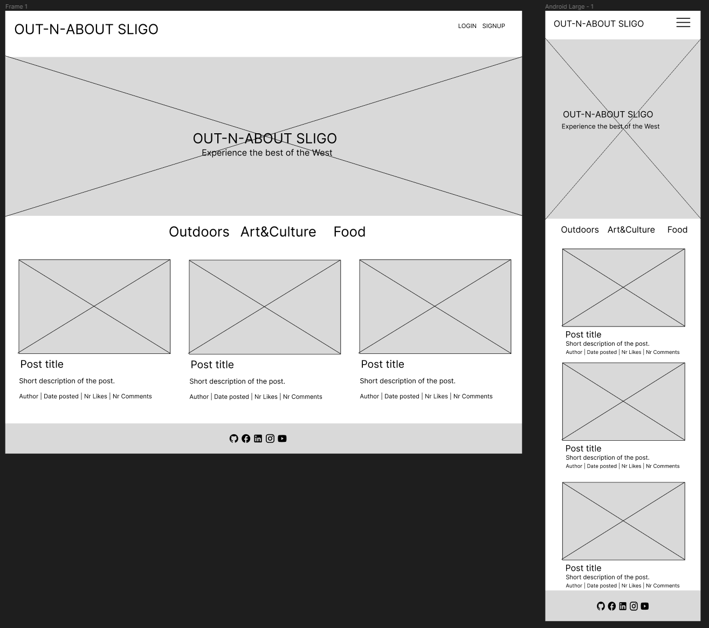
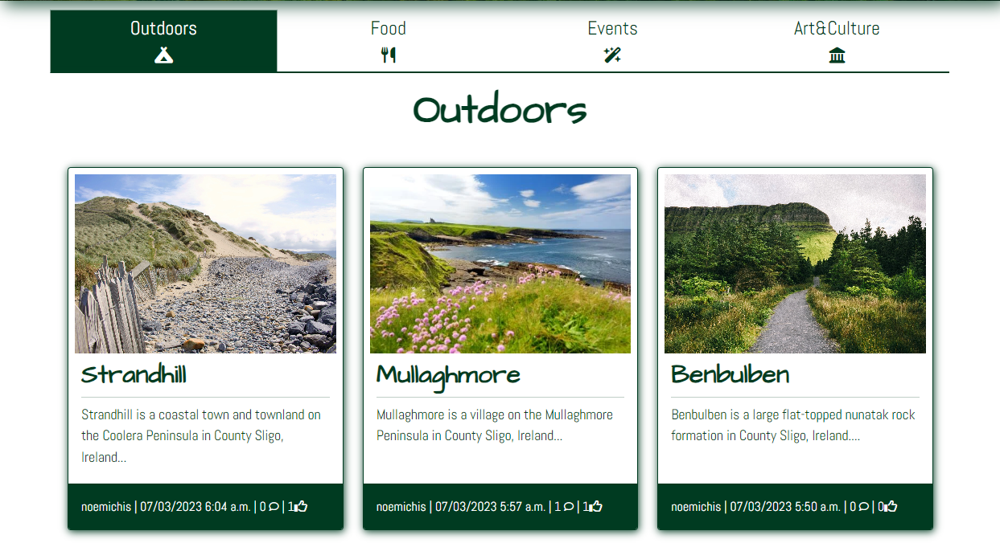

# OUT-N-ABOUT

[Website Live link](https://out-n-about.herokuapp.com/)

Out-N-About Sligo is a travel, but also local blog, with highlight places and events of the beautiful county Sligo in the West of Ireland. Users can view blogs related to different activities, also leave comments and like posts if they are authenticated. Users can also get in touch and their message will be registered in the Database, then visible on the admin panel.

## CONTENTS
- [User Experience](#user-experience)
    - [User Stories](#user-stories)

- [Design](#design)
    - [Colors](#colors)
    - [Typography](#typograpy)
    - [Wireframes](#wireframes)
    - [Database Design](#database-design)

- [Agile](#agile)

- [Features](#features)

- [Technologies](#technologies)
    - [Languages](#languages)
    - [Django packages](#django-packages)
    - [Frameworks - Libraries - Programs](#frameworks---libraries---proograms)

- [Testing](#testing)

- [Deployment](#deployment)
    - [Create Django Project](#create-django-project)
    - [Deploy to Heroku](#deploy-to-heroku)
    - [How to Fork](#how-to-fork)
    - [How to Clone](#how-to-clone)

- [Credits](#credits)
    - [Code](#code)
    - [Content](#content)

- [Acknowledgements]

## USER EXPERIENCE

### USER STORIES

|ID|User Stories|
|--|:---|
|[1](https://github.com/noemichis/out-n-about/issues/28)|As a **user** I can **create an account** so that **I can comment and like**
|[2](https://github.com/noemichis/out-n-about/issues/23)|As a **registered user** I can **login** so that **I can interact with the site**|
|[3](https://github.com/noemichis/out-n-about/issues/11)|As a **user** I can **select different categories** so that **the content is better sorted**|Posts are organized in categories/ Each category can be selected|Pass|
|[4](https://github.com/noemichis/out-n-about/issues/19)|As a **user** I can **view a list of posts** so that **I can select one to read**|
|[5](https://github.com/noemichis/out-n-about/issues/25)|As a **user** I can **see the post description** so that **I know what it will be about**|
|[6](https://github.com/noemichis/out-n-about/issues/18)|As a **user** I can **open a post** so that **I can view it's contents**|
|[7](https://github.com/noemichis/out-n-about/issues/22)|As a **user** I can **view the comments** so that **I can see others opinion**|
|[8](https://github.com/noemichis/out-n-about/issues/26)|As a **user** I can **intuitively navigate the page** so that **I have the full experience**|
|[9](https://github.com/noemichis/out-n-about/issues/17)|As a **user** I can **view the number of likes** so that **I know how popular a post is**|
|[10](https://github.com/noemichis/out-n-about/issues/16)|As a **user** I can **easily find the contact information o the site** so that **I can ask any questions**|

|ID|Authenticated User Stories|
|--|:---|
|[1](https://github.com/noemichis/out-n-about/issues/27)|As an **authenticated user** I can **easily find the log out button** so that **I can log out at anytime**|
|[2](https://github.com/noemichis/out-n-about/issues/24)|As an **authenticated user** I can **comment on a post** so that **I get engaged in the conversation**|
|[3](https://github.com/noemichis/out-n-about/issues/14)|As an **authenticated user** I can **update my comments** so that **I can edit it again**|
|[4](https://github.com/noemichis/out-n-about/issues/21)|As an **authenticated user** I can **delete my comments** so that **it's not visible to others**|
|[5](https://github.com/noemichis/out-n-about/issues/16)|As an **authenticated user** I can **like/unlike a post** so that **I can interact with the content**|

|ID|Admin User Stories|
|--|:---|
|[1](https://github.com/noemichis/out-n-about/issues/7)|As an **admin user** I can **set up an admin user** so that **I have access to the admin site**|
|[2](https://github.com/noemichis/out-n-about/issues/13)|As an **admin user** I can **create, update and delete posts** so that **I can manage the content**|
|[3](https://github.com/noemichis/out-n-about/issues/12)|As an **admin user** I can **edit and delete comments** so that **I can moderate the content**|
|[4](https://github.com/noemichis/out-n-about/issues/31)|As an **admin user** I can **view the messages sent through the contact form** so that **I can reply to them**|

## DESIGN

### COLORS

The main color scheme is simple, all page elements being based on a green color and white background. This is mainly to limit distractions, but also the green represent the true color of Ireland. The images over the blog will have all different shades of green and this will complement the dark green/white combo.

### TYPOGRAPY

### WIREFRAMES

Wireframes created with the help of Figma

- Even though the final design is slightly different to the wireframes as they were created before starting the porject, it has been very helpful to have them along the development process. 

### DATABASE DESIGN

ERD created with the help of Lucidchart

- Proposed diagram

- Final diagram

- Due to unforseen events the time to work on the project has been reduced hance the database diagram is updated to the current achievements. Hopefully all models will be implemented in the future.

## AGILE 

- GitHub issues and Github Projects were used to plans and manage the development process. Different attempts have been used as the initial approach didn't feel the easiest way. 
- All Users stories and some EPICs were converted into issues and split into sprints. Some issues have been moved around over the course of development as the work load involved wasn't realistically considered. 
- User stories have also been labeled according to the MoSCoW method.
- As issues were handled they have been moved from the  **Todo this Iteration**, to **In Progress**, to **Done**. If an issue couldn't be approached it was moved back to the **Global Backlog** for reconsideration, then into **Won't Have** if couldn't be implemented.

Iterations planning

|Iteration|Description|Due Date|Complete on|Comments|
|:--|:--|:--:|:--:|:--
|Iteration 0|Project preparation and environment set up|14/05/2023|14/05/2023|Didn't know have to close it manually|
|Iteration 1|Content and navigation|28/05/2023|15/06/2023|Family illness set back with 2.5 weeks|
|Iteration 2|User Access|01/06/2023|15/06/2023|Not a balanced iteration|
|Iteration 3|CRUD|11/06/2023|15/06/2023|N\A|
|Iteration 4|MVP complete and Testing|21/06/2023|03/07/2023|Set back another week due to no broadband|

Additional iterations were also planned and will be considered as enhancements and future addition to the project. The board and issues can be found below. 

- [GitHub Project board](https://github.com/users/noemichis/projects/6) 

- [GitHub issues](https://github.com/noemichis/out-n-about/issues)

## FEATURES

### Landing page

- Hero image to welcome the User with `Visit button` which redirects the user to the second part of the page.
- Contains a small banner at the bottom of the image that appears only if the user is not authenticated.

- The `Visit button` bring the user down to a list of all posts presented in cards. There are 6 posts on this page, which can be selected and opened. 

### Navbar

- The Navbar is present on each page and it changes state if a user is authenticated or not. Once a user signs in, the Login and Sign Up options change in the Users name and Sign Out.

- A dropdown menu is adopted on smaller screen sizes

### Categories slide

- The categories slide is rendered on nearly every page to facilitate navigation and easy access to the categories in order to find posts.
Due to this implementation it was decided not to include a standalone page that contains only the categories.
- This turns into vertical scrolling on smaller screens.

### Category Page

- When a category is active it is highlighted.

### Contact Us

- The Contact us page allows users to get in touch with the blog owner by filling out the form provided. This form is then registered to the database and will appear on the Admin Panel

### About

- Tells a little story, helping users to get a better feel about the purpose of the page

### Post detail

- Contains the title, the uploaded image(or placholder) and the details of the author, including the date
Also has a like functionality attached, so the post can be liked or unliked
- The Content section is situated right below the post image, followed by the comment section

- If the user is authenticated has the possibility to leave a comment
- If the user is the author of the comment the `Edit` and `Comment` buttons are also visible next to it

- The Edit features redirects to another page and the user can Edit their own comment, then Update it

- If clicked, the `Delete` button opens up a confirmation modal for a second prompt 

### Sign Up Page

- Possibility to Sign Up for the user, by filling in their details and submitting the form

### Login Page

- Registered Users can log in, once their credentials are validated through the form

### Sign Out Page

- If a user is authenticated they can sign out from their profile by confirming they want to leave

### Footer

- The footer is simple, giving access to the user to the social links

### Messages

- Messages are used to confirm user interaction with the website. They appear on the top of the page and fade out.

- Messages pop up with every user interaction

## Responsiveness

## TECHNOLOGIES

### LANGUAGES

- [Django](https://www.python.org/)
- [Python](https://www.djangoproject.com/)
- [HTML 5](https://en.wikipedia.org/wiki/HTML/)
- [CSS 3](https://en.wikipedia.org/wiki/CSS)

### DJANGO PACKAGES

- [Gunicorn](https://gunicorn.org/) - server for Heroku
- [django-allauth](https://django-allauth.readthedocs.io/) - user authentication
- [django-crispy-forms](https://django-crispy-forms.readthedocs.io/) - style comment form
- [psycopg2](https://pypi.org/project/psycopg2/) - PostgreSQL db Adapter
- [django-summernote](https://pypi.org/project/django-summernote/) - WYSIWYG editor for Posting

### FRAMEWORKS - LIBRARIES - PROGRAMS

- [GitHub](https://github.com/) - version control and source code
- [Gitpod](https://gitpod.io) - cloud development environment
- [Heroku](https://www.heroku.com/) - live deployment of project
- [Bootstrap5](https://getbootstrap.com/) - easy use predefined styles
- [Jquery](https://jquery.com/) - use with own script
- [ElephantSQL](https://www.elephantsql.com/) - PostgreSQL as a service
- [Figma](https://www.figma.com) - wireframe design
- [LucidChart](https://lucid.app/) - ERD diagram design
- [Lighthouse](https://developer.chrome.com/docs/lighthouse/overview/)
- [Cloudinary](https://cloudinary.com/) - hosting images
- [Font Awesome](https://fontawesome.com/) - icons
- [Google Fonts](https://fonts.google.com/) - typography
- [CANVA](https://www.canva.com/) - help with logo design
- [W3C Markup validation Service](https://validator.w3.org/) - validate HTML
- [The W3C CSS Validation Service](https://jigsaw.w3.org/) - validate CSS
- [JSHint](https://jshint.com/) - validate jQuery
- [Am I Responsive](https://ui.dev/) - test responsiveness on different devices
- [CI Python Linter](https://pep8ci.herokuapp.com/) - validate python code
- [Code Spell Checker](https://open-vsx.org/extension/streetsidesoftware/code-spell-checker) - VS Code extension 
- [Google Chrome Dev Tools](https://developer.chrome.com/docs/devtools/) - VS Code extension
- [Online-Converter](https://www.online-convert.com/) - concert images in webp

## TESTING

All testing can be found at [TESTING.md](TESTING.md)

## DEPLOYMENT 

### Create Django Project

The template used is the [CI-full-template](https://github.com/Code-Institute-Org/ci-full-template) provided by Code Institute

1. New repository is created from template
2. New workspace is opened on Gitpod
3. Install Django `pip3 install 'django<4'`
4. Install Django dependencies ans libraries
5. Create requirements.txt with `pip3 freeze --local`
6. Create Project `django-admin startproject <Project_name>`
7. Create app `python3 manage.py startapp <App_name></App_name>`
8. Add Secret Keys to env.py and remove from setting.py
9. Migrate changes `python3 manage.py migrate`
10. Create Procfile

### Deploy to Heroku

1. Create Heroku account and log in
2. Select `New` and click `Create new app`
3. Choose **name**, **region** and `Create app`
4. Navigate to `Settings`, into `Config vars` and reveal
5. Enter all relevant Config Vars
6. Navigate to `Deploy`  and choose *Github* as `Deployment method`
7. Once connected to *Github* in `App connected to GitHub` find your repo name
8. `Enable Automatic Deploys` if you want deploy new version after every push
9. `Manual Deploys` if you want to control all deployments
10. `View` link will be provided to navigate to the deployed page

### HOW TO FORK

1. Go to [GitHub](https://github.com/noemichis/out-n-about)
2. Find the `Fork` button on the top of the page and expand
3. Select `Create a new Fork`

A forked version of the project will appear in your repository 

### HOW TO CLONE

1. OpeGo to [GitHub](https://github.com/noemichis/out-n-about)
2. Find the `<>Code` dropdown and expand
3. You can select from HTTPS, SSH or GitHub CLI
4. Once selected and copied the project will appear in you repository
5. Open an IDE
6. Enter `git clone` followed by the URL
7. Clone created

## CREDITS

### CODE

- [Django Documentation](https://www.djangoproject.com/) - most code was written with the help of the Django docs with serious help in troubleshooting

    - context_processors
    - Forms - especially with ContactForm and rendering it
    - Views/Mixins
    - The message framework
- [Djangocentral](https://djangocentral.com/)
- [GeeksforGeeks](https://www.geeksforgeeks.org/) 
- [django-allauth](https://django-allauth.readthedocs.io/en/latest/#)
- [Stack Overflow](https://stackoverflow.com/) - familiarize with different ways of writing code, learn to be more analytical
- [jQuery](https://jquery.com/) - own scripts were written with help of jQuery documentation
- [Bootstrap](https://getbootstrap.com/docs/5.0/getting-started/introduction/) - Focus on learning Bootstrap from documentation. 
- Horizontal scroll inspiration from [webflow](https://discourse.webflow.com/t/horizontal-scroll-on-mobile-menu/87055)
- Inspiration for Navbar active [TEK SHINOBI](https://tekshinobi.com/setting-active-navbar-link-in-django-template/)

### CONTENT

- The inspiration for the website is taken from [DiscoverIreland](https://www.discoverireland.ie/) and [Tripadvisor](https://www.tripadvisor.ie/)

- [iStock](https://www.istockphoto.com/) was used in obtaining the static images for the page

## ACKNOWLEDGEMENTS

- To my partner for being very supportive through some difficult times, who also offered tremendous motivation all along and before the deadline.
- Code institute community for all the support and 
encouragement and the available support. 