Back to [README.md](README.md)

- [Testing](#testing)
    - [Feature testing](#feature-testing)
    - [User story testing](#user-story-testing)
    - [Lighthouse performance](#lighthouse-performance)
    - [Code validation](#code-validation)
        - [CI Python Linter](#ci-python-linter)
        - [HTML](#html)
        - [CSS](#css)
        - [jQuery](#jquery)

- [Bugs](#bugs)

# TESTING

Testing took place at all stages of development. All code written was tested straight away where possible to ensure all around site-functionality. In the event of bugs and issues, depending on the importance of the feature troubleshooting tok place straight away.

Most issues encountered have been handled with help of documentation from Django and breaking down the raised error messages to the root cause.

All features and user stories have been manually tested multiple times before closing the issue.

## FEATURE TESTING

|Page|Feature|Test Scenario|Test Case|Result|
|:---|:---:|:---:|:---:|:---:|
|All pages|Navbar|Go to Home page|Click Home link|Pass|
|All pages|Navbar|Go to Home page|Click Logo|Pass|
|All pages|Navbar|Go to About page|Click About link|Pass|
|All pages|Navbar|Go to Contact Us page|Click Contact Us link|Pass|
|All pages|Navbar|Go to Sign Up page|Click Sign Up link|Pass|
|All pages|Navbar|Go to Login page|Click Login link|Pass|
|All pages|Navbar|Go to Sign Out page|Click Sign Out link|Pass|
|All pages|Navbar|Display Login & Sign Up if not authenticated|Logout|Pass|
|All pages|Navbar|Display username & Sign Out if authenticated|Login|Pass|
|All pages|Navbar|Open Category dropdown|Click Categories link|Pass|
|All pages|Navbar|Go to selected Category|Click selected category|Pass|
|All pages|Category slide|Display all categories|All categories display|Pass|
|All pages|Category slide|Go to selected Category page|Click selected category|Pass|
|All pages|Form field validation|Required field not empty|Leave field empty|Pass|
|All pages|Messages|Message on user action is displayed|Login/ SignUp/ SignOut/ Comment/ Like/ ContactForm|Pass|
|Home page|Hero button|Go down to all posts|Click Visit button|Pass|
|Home page|Hero message|Display message if user not authenticated|Click Sign out|Pass|
|Home page|Hero message|Do not display message if user authenticated|Click Sign in|Pass|
|Home page|Hero message|Go to Login page|Click Login button|Pass|
|Home page|Hero message|Go to Sign Up page|Click Sign Up button|Pass|
|Home page|Card loop|Display all cards|All cards display correctly|Pass|
|Home page|Cards loop|Go to selected Post page|Click selected post|Pass|
|Categories page|Category slide|Category active|Click selected category|Pass|
|Categories page|Conditional check posts|Show posts from selected category only|Click selected category|Pass|
|Post Detail page|Like button if authenticated|Register like on page|Click regular thumbs up icon|Pass|
|Post Detail page|Like button if not authenticated|Button not clickable|No action|Pass|
|Post Detail page|Unlike post|Remove like from page|Click solid thumbs up icon|Pass|
|Post Detail page|Leave a comment if authenticated|Comment submitted|Add comment and submit|Pass|
|Post Detail page|Leave a comment if not authenticated|Not shown|No action|Pass|
|Post Detail page|Edit and Delete buttons if user=creator|Show buttons|Login|Pass|
|Post Detail page|Edit and Delete buttons if user!=creator|Not shown|Logout|Pass|
|Post Detail page|Edit comment|Go to Comment Edit page|Click Edit button|Pass|
|Post Detail page|Delete comment|Open Comment Delete Modal|Click Delete button|Pass|
|Post Detail page|Confirm Comment Delete|Confirm Delete comment|Click Delete button|Pass|
|Post Detail page|Close Comment Delete Modal|Close Modal|Click Close button/Click X on top|Pass|
|Comment Edit page|Edit comment|Update existing comment|Edit then click Update button|Pass|
|Sign Up page|Redirect to Login|Go to Login page|Click login link|Pass|
|Sign Up page|Sign Up button|Sign Up and go to Home page|Click Sign Up button|Pass|
|Sign Up page|Username validation|Username exists|Enter existing username|Pass|
|Sign Up page|Password validation|Password too short/common|Enter short/common password|Pass|
|Sign Up page|Password validation|Password must be same in both fields|Enter different password in again field|Pass|
|Login page|Login button|Login and go to Home page|Click Login button|Pass|
|Login page|Password/username validation|Password and username must exist|Enter incorrect credentials|Pass|
|Login page|Remember me checkbox|Allow user to stay authenticated|Checkbox active|Pass|
|Sign Out page|Sign Out button|Sign Out and go to Home page|Click Sign Out button|Pass|
|Contact Us page|Submit message to database|Message sent on submit|Click Submit button|Pass|
|Footer|Social links|Go to social page|Facebook/ Instagram/ Twitter|Pass|

## USER STORY TESTING

|ID|User Story|Acceptance criteria|Test Case|
|--|:---|:---|:---|
|[1](https://github.com/noemichis/out-n-about/issues/28)|As a **user** I can **create an account** so that **I can comment and like**|Account can be created and functional|Pass|
|[2](https://github.com/noemichis/out-n-about/issues/23)|As a **registered user** I can **login** so that **I can interact with the site**|Login with username/email and password|Pass|
|[3](https://github.com/noemichis/out-n-about/issues/27)|As an **authenticated user** I can **easily find the log out button** so that **I can log out at anytime**|Place the logout button evidently/ Logout function works|Pass|
|[4](https://github.com/noemichis/out-n-about/issues/11)|As a **user** I can **select different categories** so that **the content is better sorted**|Posts are organized in categories/ Each category can be selected|Pass|
|[5](https://github.com/noemichis/out-n-about/issues/19)|As a **user** I can **view a list of posts** so that **I can select one to read**|Posts are listed on landing page/ Posts are listed under Category page|Pass|
|[6](https://github.com/noemichis/out-n-about/issues/25)|As a **user** I can **see the post description** so that **I know what it will be about**|Post summary visible for all users|Pass|
|[7](https://github.com/noemichis/out-n-about/issues/18)|As a **user** I can **open a post** so that **I can view it's contents**|A user can select a post and open it/ All post information is available once opened|Pass|
|[8](https://github.com/noemichis/out-n-about/issues/22)|As a **user** I can **view the comments** so that **I can see others opinion**|Comments can be viewed by all users|Pass|
|[9](https://github.com/noemichis/out-n-about/issues/24)|As an **authenticated user** I can **comment on a post** so that **I get engaged in the conversation**|Comments can be posted and are visible|Pass|
|[10](https://github.com/noemichis/out-n-about/issues/14)|As an **authenticated user** I can **update my comments** so that **I can edit it again**|Comments can be updated by creator|Pass|
|[11](https://github.com/noemichis/out-n-about/issues/21)|As an **authenticated user** I can **delete my comments** so that **it's not visible to others**|Comments can be deleted by creator|Pass|
|[12](https://github.com/noemichis/out-n-about/issues/26)|As a **user** I can **intuitively navigate the page** so that **I have the full experience**|Intuitive navigation page|Pass|
|[13](https://github.com/noemichis/out-n-about/issues/17)|As a **user** I can **view the number of likes** so that **I know how popular a post is**|Like count is visible to all users|Pass|
|[14](https://github.com/noemichis/out-n-about/issues/16)|As an **authenticated user** I can **like/unlike a post** so that **I can interact with the content**|Like button can be clicked, then unlicked|Pass|
|[15](https://github.com/noemichis/out-n-about/issues/16)|As a **user** I can **easily find the contact information o the site** so that **I can ask any questions**|Contact details and page functional|Pass|

|ID|Admin User Story|Acceptance criteria|Test Case|
|--|:---|:---|:---|
|[1](https://github.com/noemichis/out-n-about/issues/7)|As an **admin user** I can **set up an admin user** so that **I have access to the admin site**|Admin panel ready to use|Pass|
|[2](https://github.com/noemichis/out-n-about/issues/13)|As an **admin user** I can **create, update and delete posts** so that **I can manage the content**|Post can be created, updated, deleted via the Admin site|Pass|
|[3](https://github.com/noemichis/out-n-about/issues/12)|As an **admin user** I can **edit and delete comments** so that **I can moderate the content**|Comments can be updated/deleted from the Admin site|Pass|
|[4](https://github.com/noemichis/out-n-about/issues/31)|As an **admin user** I can **view the messages sent through the contact form** so that **I can reply to them**|Admin users are able to view messages in the Admin panel|Pass|

### [Lighthouse](https://developer.chrome.com/docs/lighthouse/overview/) performance

Desktop

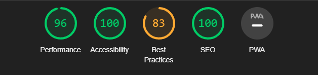

Mobile

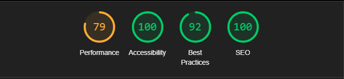

### [Wave](https://wave.webaim.org/) accessibility

Home

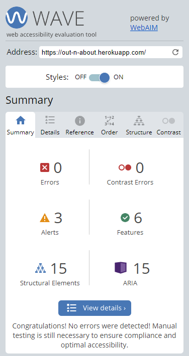

Categories

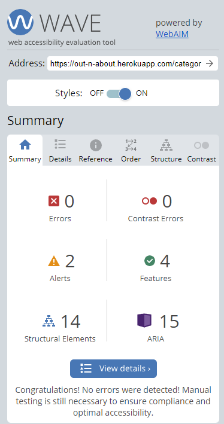

Post

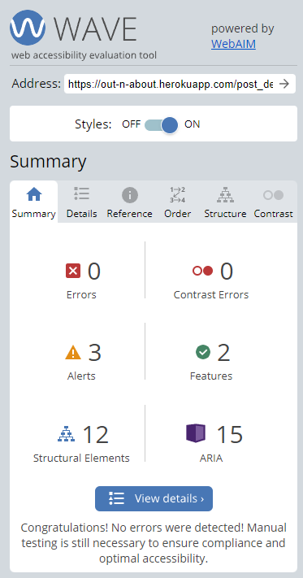

Contact

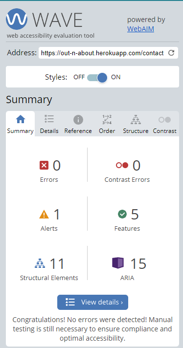

Login

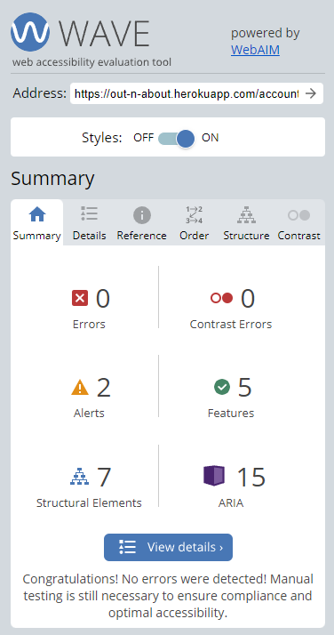

Sign Out

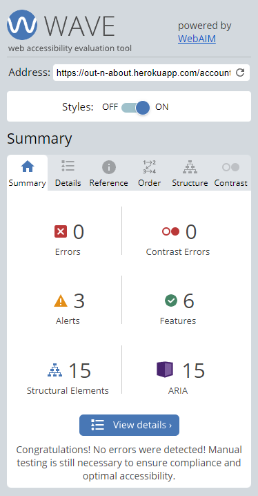

Sign Up

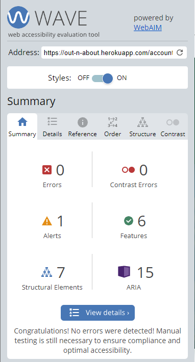

## Code validation

### [CI Python Linter](https://pep8ci.herokuapp.com/)

**Out-N-About - outnabout**  

settings.py

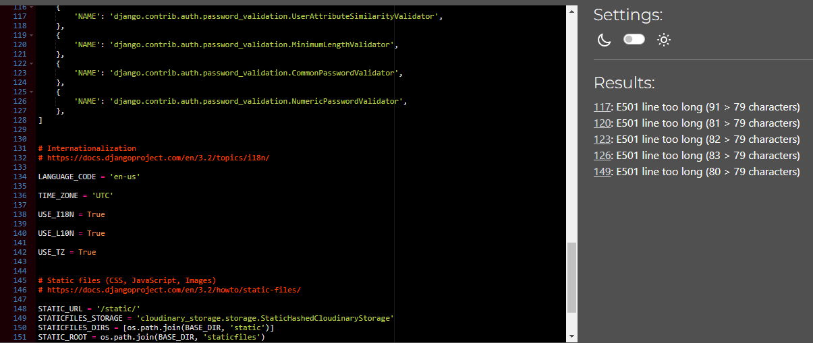
Line too long errors are found in settings.py as a result of using the base template

urls.py

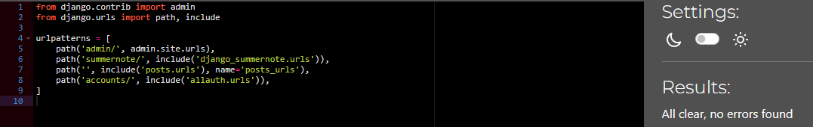

wsgi.py

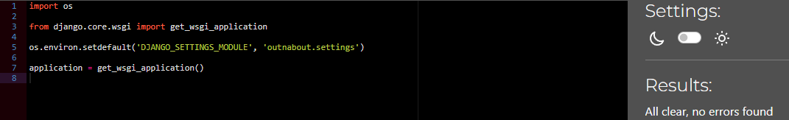

asgi.py

manage.py

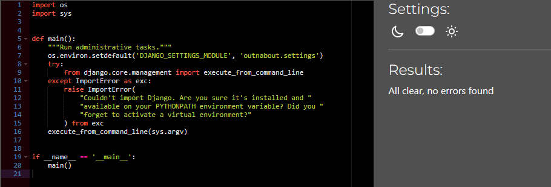

**Out-N-About - posts** 

admin.py

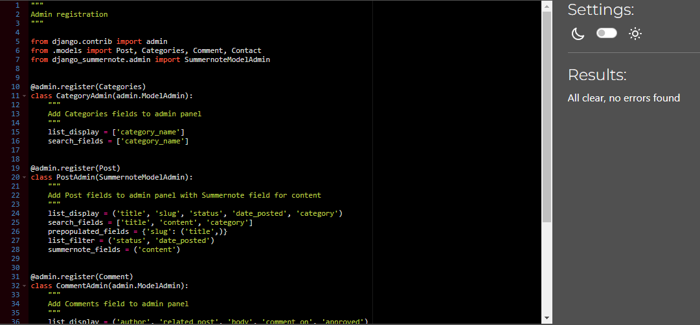

apps.py

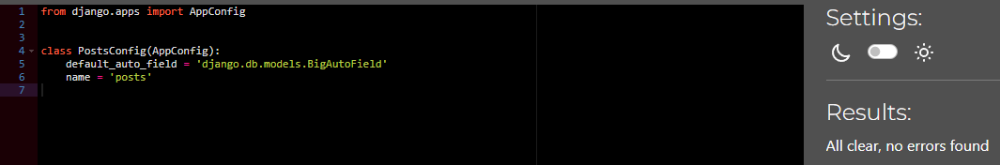

context_processors.py

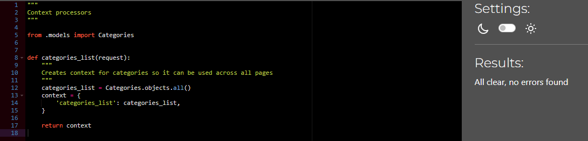

forms.py

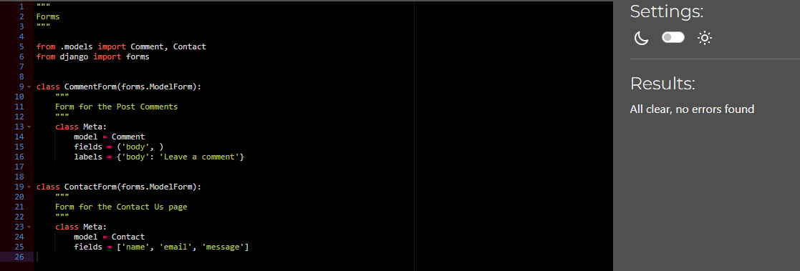

models.py

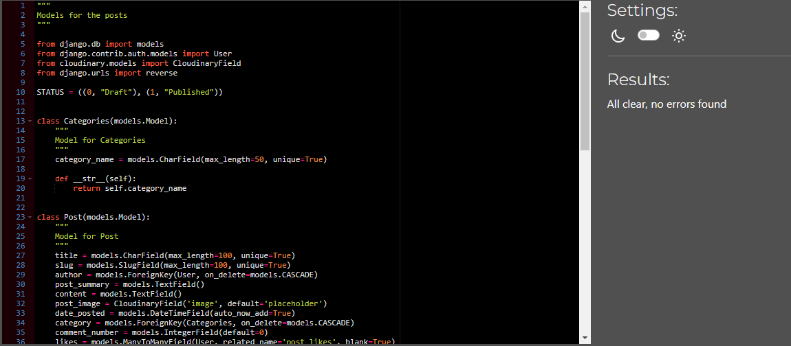

urls.py

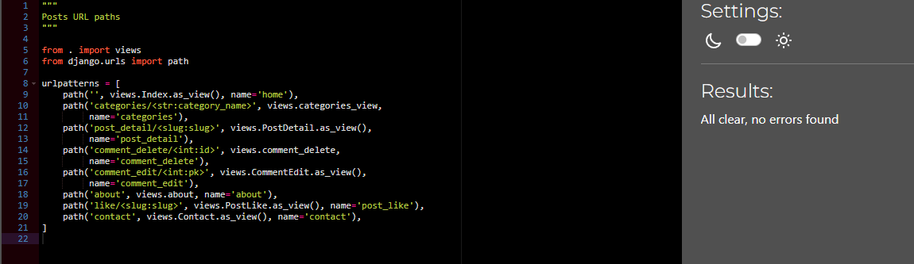

views.py

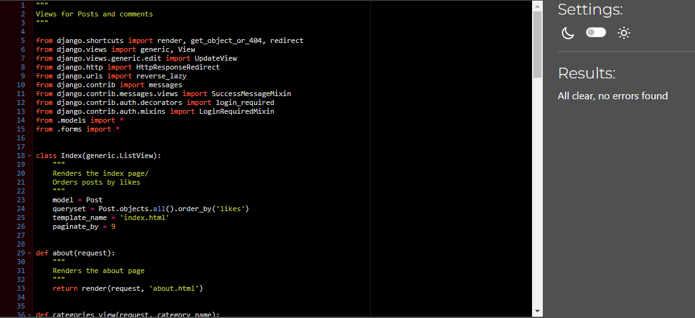

### HTML
Tested with [W3C Markup validation Service](https://validator.w3.org/)

Home
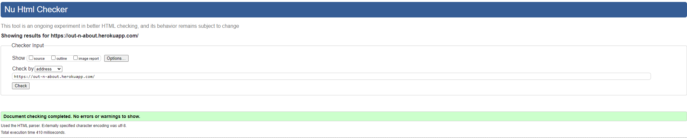

Categories
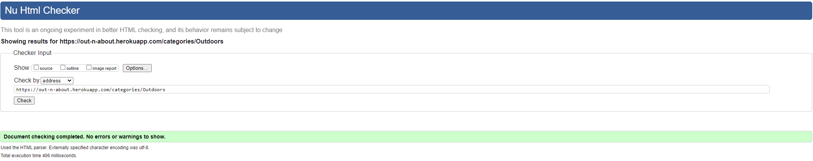

Contact
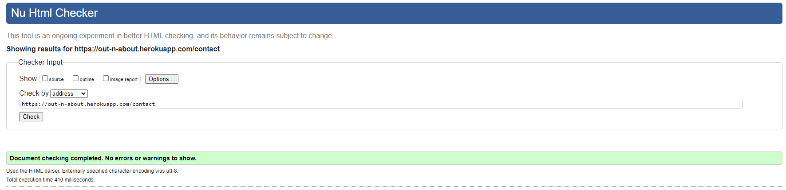

Sign Out
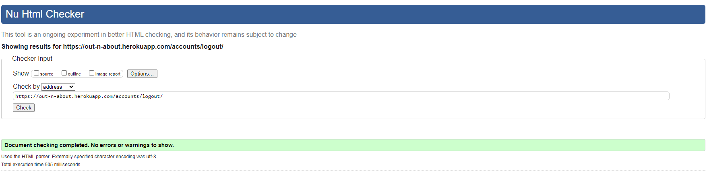

Sign Up
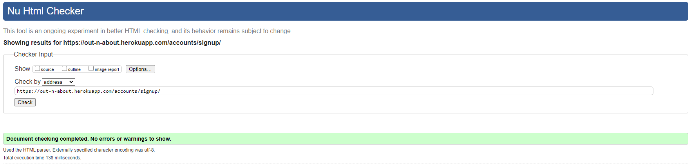

Login
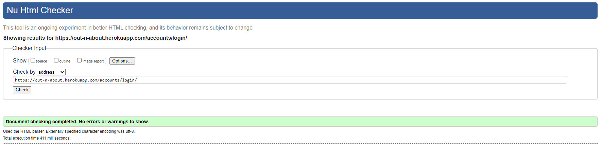

### CSS
Tested with [The W3C CSS Validation Service](https://jigsaw.w3.org/)

style.css
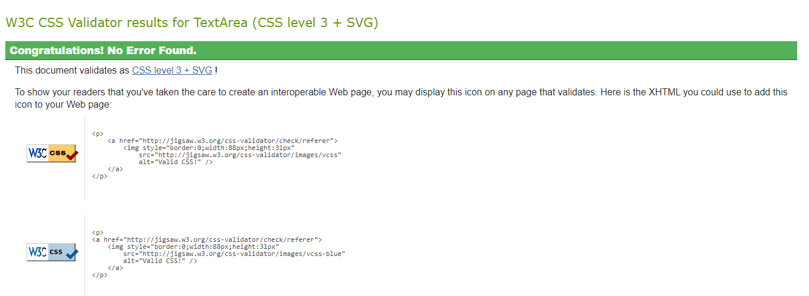

- No errors found in static style.css when passed through validation

- Note: Due to the use of Bootstrap when passing the deployed site through Jigsaw some vendor extension warnings are raised. 

### jQuery
Tested with [JsHint](https://jshint.com/)

jQuery result
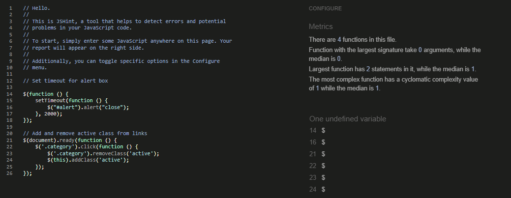

- Outcome of jQuery code validation

# BUGS

Throughout the development process multiple issues were encountered. Many due to rookie mistakes, but was a great experience trying to resolve them.

### Resolved bugs 

Bug 1 - NoReverseMatch

- Error message

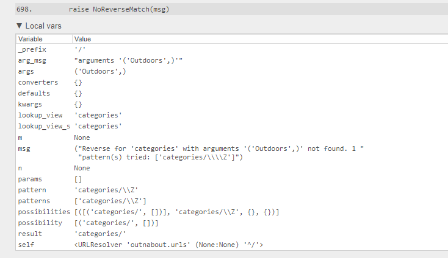

- Fix: Update url path for categories

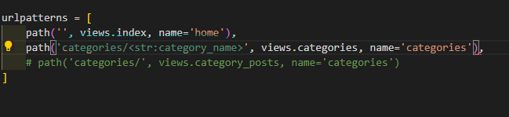

Bug 2 - Database referencing issue

- Error message

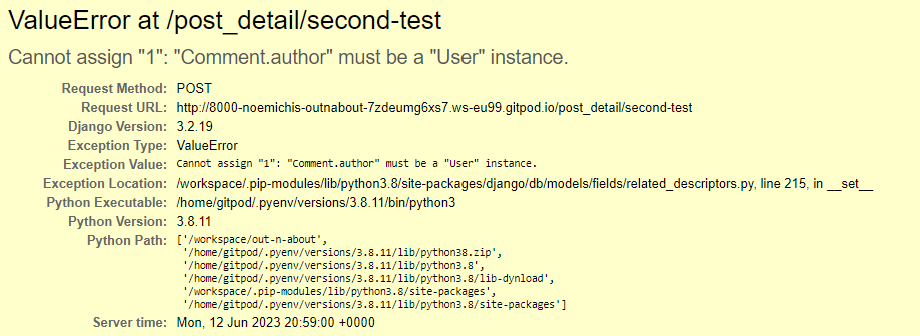

- Fix: Update PostDetail view to set comment author to the request user

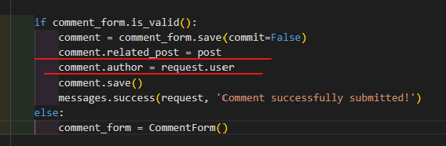

- Cause: Author using ForeignKey reference to Base User

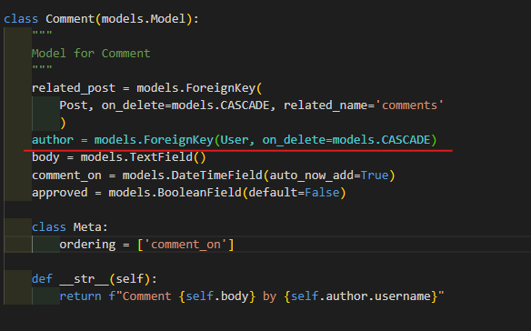

Bug 3 - Label missing

- Error message

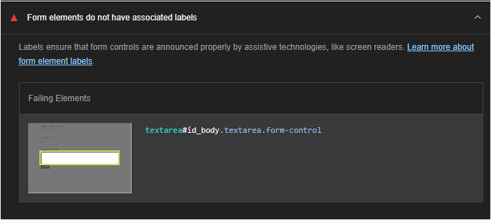

- Fix: Update form field

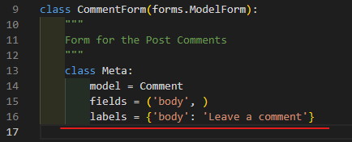

- Cause: The label display is set to none due to wanting to hide the label name

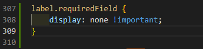

Bug 4 - Cloudinary console error

- Error message

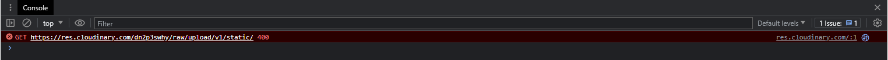

- Fix: Upload images to Cloudinary and set background image url

Other smaller issues have also been handled to improve accessibility, performance and best practice. 

### Unresolved bugs

Lighthouse has highlighted some issues I have not yet been able to resolve and will need to research further solutions

1. The page has an unload handler in the main frame 
2. Avoid serving legacy JavaScript to modern browsers
3. Eliminate render-blocking resources

Back to [README.md](README.md)